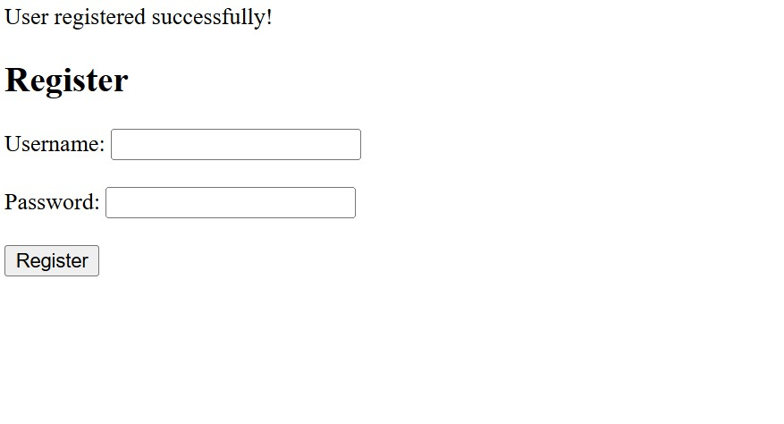
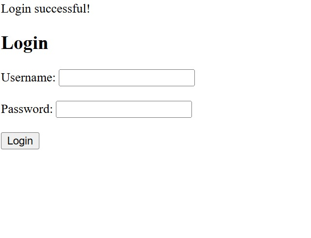
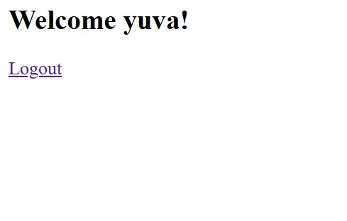

# Task 4 – Security Enhancements (ApexPlanet Internship)

## 🔐 Implemented Security Features

- Password hashing using `password_hash()`
- Secure login verification using `password_verify()`
- SQL Injection prevention using Prepared Statements
- Session management for authentication
- Protected dashboard page
- Secure logout functionality

## 🛠 Technologies Used

- PHP
- MySQL
- XAMPP
- phpMyAdmin

## 📂 Project Structure

- db.php – Database connection
- register.php – User registration with password hashing
- login.php – Secure login using prepared statements
- dashboard.php – Protected user dashboard
- logout.php – Session destroy and logout

---

## 📸 Screenshots

Below are the screenshots of the working application:

---

## 📌 Description

This project implements security enhancements for a PHP & MySQL web application as part of the ApexPlanet Internship Program.

The application includes secure authentication, prevention of SQL injection, password encryption, and proper session handling to ensure safe user login and data protection.
